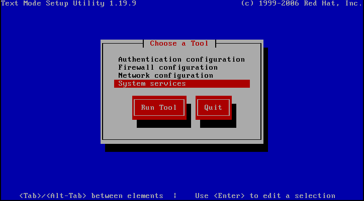
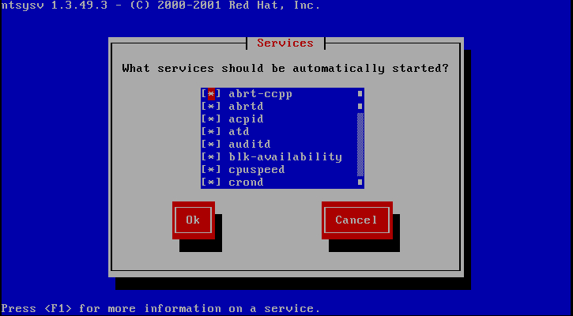

# Linux_优化

### 系统版本查看
```
cat /etc/redhat-release
uname -r
uname -m
uname -a

```

### 磁盘分区
>* 主分区（一块硬盘最多有4个主分区）
>* 扩展分区（最多一个，必须在扩展分区上划分逻辑分区）
>* 逻辑分区

`格式化`主要是写入文件系统


### 关闭系统不必要的服务
```
setup
```


```
ntsysv
```


Linux必开的服务
>* crond		定时任务
>* network	网络
>* rsyslog	系统日志
>* sshd			ssh

### 查看系统开机启动的服务
```
chkconfig --list|grep "3:on"

abrt-ccpp      	0:off	1:off	2:off	3:on	4:off	5:on	6:off
abrtd          	0:off	1:off	2:off	3:on	4:off	5:on	6:off
acpid          	0:off	1:off	2:on	3:on	4:on	5:on	6:off
atd            	0:off	1:off	2:off	3:on	4:on	5:on	6:off
auditd         	0:off	1:off	2:on	3:on	4:on	5:on	6:off
blk-availability	0:off	1:on	2:on	3:on	4:on	5:on	6:off
cpuspeed       	0:off	1:on	2:on	3:on	4:on	5:on	6:off
crond          	0:off	1:off	2:on	3:on	4:on	5:on	6:off
haldaemon      	0:off	1:off	2:off	3:on	4:on	5:on	6:off
ip6tables      	0:off	1:off	2:on	3:on	4:on	5:on	6:off
iptables       	0:off	1:off	2:on	3:on	4:on	5:on	6:off
irqbalance     	0:off	1:off	2:off	3:on	4:on	5:on	6:off
kdump          	0:off	1:off	2:off	3:on	4:on	5:on	6:off
lvm2-monitor   	0:off	1:on	2:on	3:on	4:on	5:on	6:off
mcelogd        	0:off	1:off	2:off	3:on	4:off	5:on	6:off
mdmonitor      	0:off	1:off	2:on	3:on	4:on	5:on	6:off
messagebus     	0:off	1:off	2:on	3:on	4:on	5:on	6:off
netfs          	0:off	1:off	2:off	3:on	4:on	5:on	6:off
network        	0:off	1:off	2:on	3:on	4:on	5:on	6:off
postfix        	0:off	1:off	2:on	3:on	4:on	5:on	6:off
rsyslog        	0:off	1:off	2:on	3:on	4:on	5:on	6:off
sshd           	0:off	1:off	2:on	3:on	4:on	5:on	6:off
sysstat        	0:off	1:on	2:on	3:on	4:on	5:on	6:off
udev-post      	0:off	1:on	2:on	3:on	4:on	5:on	6:off

```

`udev-post`服务名称

### 关闭系统开机启动的服务
> chkconfig udev-post off

### 查看某个服务
> chkconfig --list udev-post

### 关闭不必要的开机启动项
#### 查看哪些服务开机自启
>  chkconfig --list|grep "3:on"|awk '{print $1}'

#### 关闭3启动级别下的所有服务
> for qshan in \`chkconfig --list|grep "3:on"|awk '{print $1}'\`;do chkconfig $qshan off;done

#### 打开需要的自启服务
> for qshan in crond network rsyslog sshd  ;do chkconfig $qshan on;done

#### 过滤必须启动项
> chkconfig --list|grep "3:on"|awk '{print $1}'|grep -vE "crond|rsyslog|sshd|network"

> for qshan in \`chkconfig --list|grep "3:on"|awk '{print $1}'|grep -vE "crond|rsyslog|sshd|network"\`; do chkconfig $qshan off;done

### ssh 服务端口修改
#### ssh 端口服务配置文件 /etc/ssh/sshd_config
> vi /etc/ssh/sshd_config

#### 修改ssh端口
##### 在13行左右设置
```
Prot 52113
#Port 22
```

`系统总端口数65535`

#### 禁止root用户远程ssh登录
##### 在43行左右设置
```
PermitRootLogin no
```
> 在修改此功能时请先创建普通用户，并通过`su - root`可以登录到root用户


#### 优化ssh登录慢
##### 在122行左右设置
```
UseDNS no
```
##### 在81行左右设置
```
GSSAPIAuthentication no
```

#### 重启sshd服务
> /etc/init.d/sshd restart

### 临时关闭防火墙
> /etc/init.d/iptables stop

### 给普通用户root命令的权限
#### visudo 与 vi /etc/sudoers 效果一样
##### 在30行左右设置

**给san用户root权限**
> san     ALL=(ALL)       NOPASSWD: ALL

**给hadoop用户执行useradd和passwd命令的权限**
> hadoop  ALL=(ALL)			 /etc/sbin/useradd,/usr/bin/passwd

[CentOS6.3 系统中su，su -，sudo三命令讲解](http://blog.csdn.net/zolalad/article/details/11369423 "CentOS6.3 系统中su，su -，sudo三命令讲解")

### 用户PATH


全局生效、/etc/profile
普通用户生效 ~/.bash_profile或者~/.bashrc


### 字符集修改
> vi /etc/sysconfig/i18n

```
#LANG="en_US.UTF-8"
LANG="zh_CN.GB18030"
SYSFONT="latarcyrheb-sun16"
```

> source /etc/sysconfig/i18n
> echo $LANG

### 时间同步
#### ntp时间同步

### 文件描述符
> echo '* - nofile 65535' >> /etc/security/limits.conf

### 调整内核参数
> vi etc

[CentOS（5.8/6.4）linux生产环境若干优化实战](http://oldboy.blog.51cto.com/2561410/1336488 "linux生产环境若干优化实战")

[linux内核参数注释与优化](http://yangrong.blog.51cto.com/6945369/1321594 "linux内核参数注释与优化")


### 定时清理 clientmqueue 目录垃圾文件防止占满磁盘空间
/var/spool/clientmqueue/sendmail 邮件服务邮件临时存放地点

### 登录提示
> vi /etc/issue

### 登录提示
> vi /etc/motd

### 锁定系统关键文件
> chattr +i /etc/passwd /etc/shadow /etc/group /etc/gshadow /etc/inittab

### 解锁系统关键文件

> chattr -i /etc/passwd /etc/shadow /etc/group /etc/gshadow /etc/inittab
