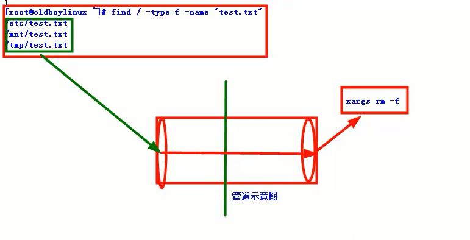
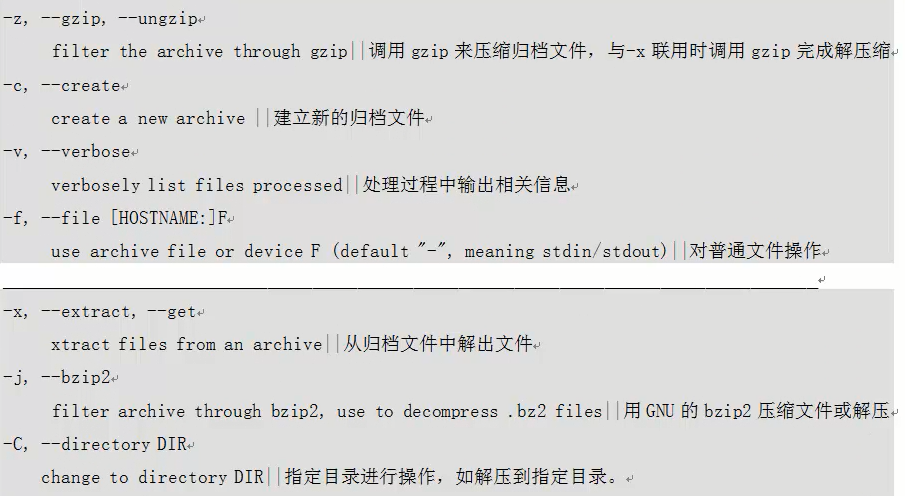
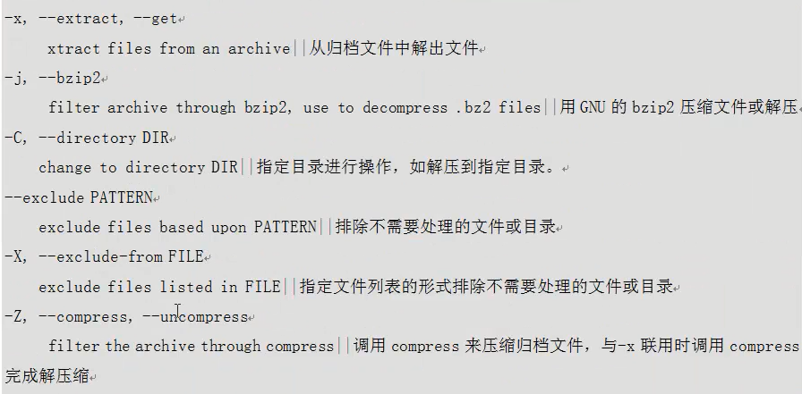
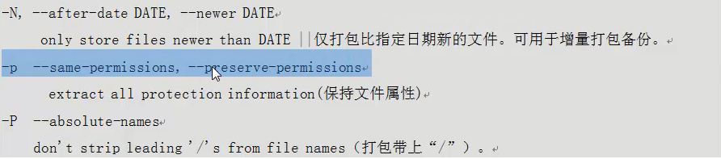

# Linux_常用命令


### 符号
; 多个命令的分隔符

/ 根或者路径分隔符

\> 标准输出重定向，覆盖原来的文件

\>> 追加重定向

< 标准输入重定向

<< 输入重定向

.. 上级目录

. 当前目录

~ 用户家目录


### cd 切换目录
> cd ~    家目录

> cd -    上一次的目录    


### ls(list) 显示目录或文件
> ll -d    显示目录

> ll -a    显示隐藏文件

> ll -r			翻转排序

> ll -t     按照修改时间排序

### mkdir 创建目录
```
mkdir -p /data
```
-p 递归创建

### touch 创建文件
```
touch /data/qingshan.log
```
Windows的目录分隔---->D:\Program Files

Linux的目录分隔------>/data/


### vi/vim 文本编辑
```
vi o.log
a 或者 i 进入编辑模式
Esc退出编辑模式，进入命令模式
:wq保存退出

```
#### vi常用快捷键
```
命令模式 g+g 跳到文件开头
命令模式 Shift+g 跳到文件结尾
命令模式 数字+g+g 跳到指定数字的行

命令模式 dd 删除一行
命令模式 yy 复制当前行
命令模式 p  粘贴

命令模式 :set nu  显示行号
命令模式   :q!  强制退出

```


### cat 查看文本内容
```
cat -n o.log
-n    显示行号


追加EOF内的内容到 a.log
cat >>a.log<<EOF
ASDF
QWER
ZXCV
EOF


```


### echo 打印输出内容
```
echo "Hello World" > o.txt
echo "Hello QF" >> o.txt

**-n**不换行

**-e**可指定特殊的字符（\t \n 等）

```
`>`重定向输出，覆盖输出

`>>`重定向输出，追加输出


### printf  
> format and print data


### cp 拷贝文件或者目录
```
cp o.txt /temp/o.txt
cp -a /etc/ /tem/
```
cp [-aifpru] [源文件] [目标文件]
-a：相当于 -pdr

-d：若文件为链接文件（link file），则复制链接文件属性而非文档本身

-f: 强制，若目标文档已经存在且无法开启，则移除后再尝试

-i：若目标文件已经存在是，在覆盖时会先询问

-p：连同文档的属性一起复制，而非使用默认属性

-r：递归，用于复制目录

-u：若目标文件存在，则目标文件比源文件旧时才复制


### mv 移动  move (rename) files
```
mv /data /root/

```
mv [-ifu] [源目录/源文件] [目标目录/目标文件]

-ifu 意义同 cp命令


### rename 改名


### rm(remove) 删除 、rmdir 删除空目录
```
cd /root/data
rm -f o.txt
```
**-f** 强制
**-r** 删除目录


## 查看文件前两行的数据

测试数据
```
cat >test.txt<EOF
test
liyao
qf
EOF
```
### grep 过滤(三剑客老三)

**查看文件前两行的数据**
```
grep -v qf test.txt
grep qf test.txt

```

**用法**
```
-v 排除

-E 过滤多个

-i 大小写过滤

egrep 相当于 grep -E

```


### sed 取各种内容(三剑客老二)

**查看文件前两行的数据**
```
sed /li/p test.txt
sed -n /li/p test.txt
sed /qf/d test.txt
```


### awk(三剑客老大)

**查看文件前两行的数据**
```
awk /[^qf]/ test.txt
```

>* sed 擅长输出行
>* awk 擅长列

**用法**
```
$0整行

$1第一列

$2第二列

$NF最后一列

```

```
测试数据
echo i am qingshan myqq is 123456789 > shan.txt
案例
awk '{print $3 $6}' shan.txt
awk '{print $3" "$6}' shan.txt
awk '{print $3"-"$6}' shan.txt

cut -d" " -f3,6 shan.txt
cut -c 6-13,22- shan.txt

测试数据
echo i am qingshan,myqq is 123456789 > shan.txt
案例
cut -d" " -f3,5 shan.txt
cut -d" " -f3,5 shan.txt|sed s#,#" "#g

awk -F '[ ,]' '{print $3" "$6}' shan.txt
```


### head 头部
```
hesd -2 test.txt

```
**-n**   行号


### tail 尾部
```
tail -2 test.txt

```
**-f**  动态跟踪文件的变化

**tailf**

**tail -F**


### alias 别名

### unalias 取消别名

### which 查看命令路径 whereis locate find

### whereis -b 查找二进制命令
```
[root@node0 data]# locate -n 1 mkdir
/bin/mkdir
```


### find 查找

```
find / -type f -name "cat"
find / -name "cat"
find / -type f -name "o.txt" -exce rm -f {} \;
```

>* {}:find找到的内容
>* -exec到\:都是参数(它与额外命令之前后都要有空格)
>* rm -f {}:额外命令
>* ;是bash特殊的意义，就用反斜杠转译

```
find / -type f -name "text.txt"|xargs rm -f
```
**|**：管道 通过管道把前一个命令的输出交给后一个命令继续处理

**管道符前后可以不用空格**



```
find / -type f -mtime +5
find /root/ -type f -mtime +5
find /root/ -type f -mtime -5
find /roor/ -type f -name "*.log" -mtime +5|xargs rm -f
```

**-mtime** 按照修改时间查找

**-atime** n #n为数字，最后访问时间

**-ctime** n #n为数字，状态改变时间


### seq 序列|打印数字序列
```
seq 6
seq -s " " 6
seq -s "+" 6
seq 2 6
seq 1 2 9
seq 1 5|tac
seq 100 >ett.txt
head -30 ett.txt|tail -11
sed -n 20,30p ett.txt
awk '{if(NR>19&&NR<31) print $0}' ett.txt
awk '{if(NR==19) print $0}' ett.txt
awk -F ":"'{print $1}' /etc/passwd

```

### tac  倒叙输出
> seq 1 5|tac


### tree 查看目录结构

### xargs 用于把find/ls的输出交给后面处理

### man 查看命令及配置文件等帮助

### history 查看历史命令记录
**-c** 清空历史命令

**-d 5** 删除第5行的历史记录


### diff 比较文件内容差别

### vimdiff 比较文件内容差别


### yum  包管理工具|解决rpm包的依赖
> yum  is  an  interactive,  rpm  based, package manager.

> yum

> yum install tree telnet dos2net sysstat lrzsz -y

> yum grouplist

### rpm -ivh 软件安装命令

### wget 下载

### w
>Show who is logged on and what they are doing.

### 查找命令的所在地
> which useradd

### 查看网络状态
> netstat -lntup|grep ssh

> lsof -i :52113

#### ntp 时间服务器配置

### 文件描述符
> ulimit -n

加大文件描述符
> ulimit -HSn 65535


### 查找某个路径下的文件夹
> find ./ -type d

> find ./ -type d ! -name "."

> find . -maxdepth 1 -type d ! -name "."

> ll -F|grep /$

> ll |grep ^d


### /etc/profile  环境变量
> vi /etc/profile

> source /etc/profile


### 软连接
> ln -s /application/apache2.2.17/ /application/apache

> for n in \`seq 14\`

> do

> date -s "04/0$n/13"

> touch log_\`(date +%F)\`.log

> done

> 将时间调整到20160704

> date -s "07/04/2016"


### 删除7天前的文件
> find ./ -type f -name "*.log" -mtime +7|xargs rm -f

> find ./ -type f -name "*.log" -mtime +7 -exec rm -f {} \;


### tar
```
tar zcvf etc.tar.gz ./etc
```
查看包的内容
```
tar tf etc.tar.gz
```
排除打包
```
tar zcvf etc.tar.gz --exclude=etc/sysconfig ./etc/
```
解压
```
tar xvf etc.tar.gz
```
指定目录解压
```
tar xvf etc.tar.gz -C /data/tmp/
```

**z**压缩
**c**创建文件
**v**显示输出
**f**处理文件






### 查看文件行号
```
wc -l  /etc/services
cat -n /etc/services|tial -1
awl '{print NR}' /etc/services|tial -1

```
[参考wc](http://oldboy.blog.51cto.com/2561410/577227)


### 查看进程个数
```
ps -ef|grep syslog|grep -v grep|wc -l

grep -E "3306,1521" /etc/services
egrep "3306,1521" /etc/services

```

### date

**-s**修改时间
```
date -s "07/04/2016"

date +%F-%T

```

**将date的执行结果当做字符输出**
```
tar zcvf etc-$(date +%w).tar.gz /etc/

```

**日期时间操作**
```
[root@node0 /]# date +%F --date='3 day ago'
2016-07-03
[root@node0 /]# date +%F -d '3 day ago'    
2016-07-03
[root@node0 /]# date +%F -d 'next day'
2016-07-07
[root@node0 /]# date +%F -d '+3 day'  
2016-07-09
[root@node0 /]# date +%F -d '-3 day'
2016-07-03

[root@node0 /]# date +%H -d '3 hour ago'
21
[root@node0 /]# date +%H -d '3 hour'    
03
[root@node0 /]# date +%H -d '+3 hour'
03
[root@node0 /]# date +%H -d '-3 hour'  
21

```
