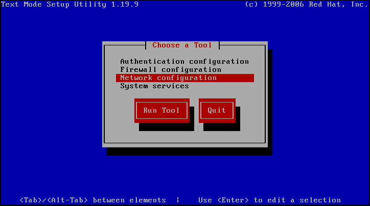
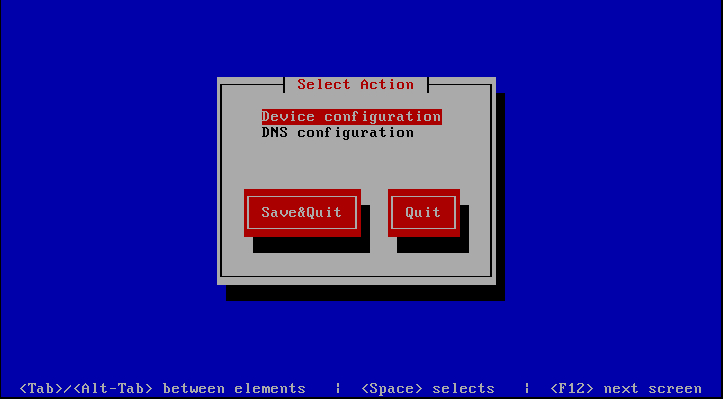
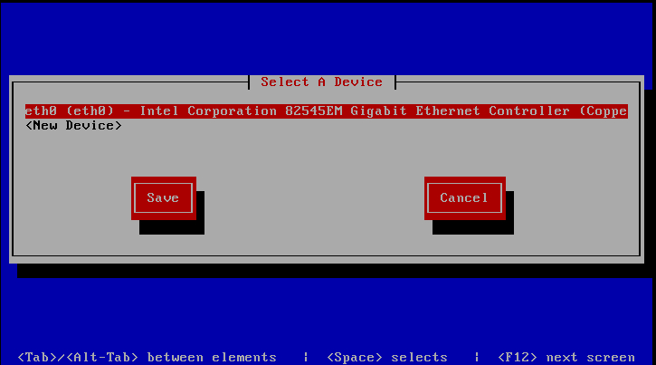
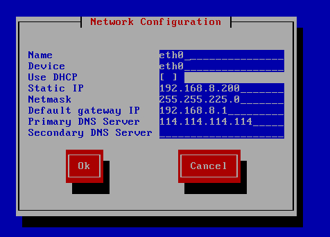
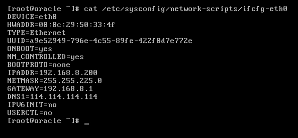
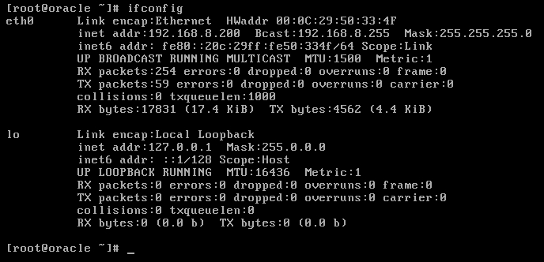

# Linux_网络配置

### 网卡查看
```
ifconfig
```

### 配置网卡
```
setup
```

#### 设备配置



#### 设置IP，子网掩码，网关，DNS

#### 修改eth0网卡信息
```
vim /etc/sysconfig/network-scripts/ifcfg-eth0
```




#### 重启网络
```
/etc/init.d/network restart
 service network restart
```


[Linux系统基础网络配置老鸟精华篇](http://oldboy.blog.51cto.com/2561410/784625 "Linux系统基础网络配置老鸟精华篇")
