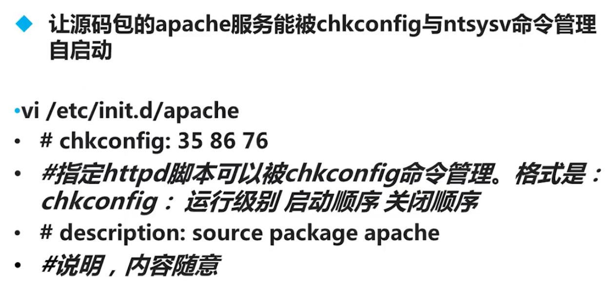
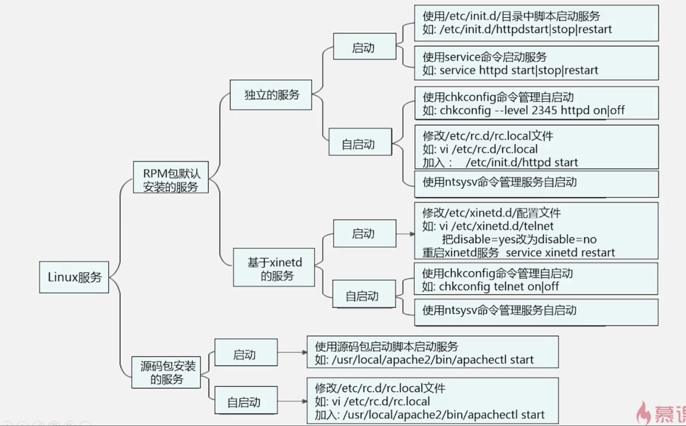

# Linux服务管理

### 系统运行级别

> 0 关机

> 1 单用户模式 用于系统修复

> 2 不完全的命令模式 不包含NFS服务

> 3 完全的命令模式 标准字符界面

> 4 系统保留

> 5 图像界面

> 6 重启

```
[root@node0 /]# runlevel
N 3
[root@node0 /]# init 5
[root@node0 /]# runlevel
3 5
```

修改系统启动级别
```
[root@node0 /]# vim /etc/inittab
# inittab is only used by upstart for the default runlevel.
#
# ADDING OTHER CONFIGURATION HERE WILL HAVE NO EFFECT ON YOUR SYSTEM.
#
# System initialization is started by /etc/init/rcS.conf
#
# Individual runlevels are started by /etc/init/rc.conf
#
# Ctrl-Alt-Delete is handled by /etc/init/control-alt-delete.conf
#
# Terminal gettys are handled by /etc/init/tty.conf and /etc/init/serial.conf,
# with configuration in /etc/sysconfig/init.
#
# For information on how to write upstart event handlers, or how
# upstart works, see init(5), init(8), and initctl(8).
#
# Default runlevel. The runlevels used are:
#   0 - halt (Do NOT set initdefault to this)
#   1 - Single user mode
#   2 - Multiuser, without NFS (The same as 3, if you do not have networking)
#   3 - Full multiuser mode
#   4 - unused
#   5 - X11
#   6 - reboot (Do NOT set initdefault to this)
#
id:3:initdefault:
```


### 启动&自启动
```
chkconfig --list
```

### 服务&端口
TCP
UDP
65536个

#### 查询系统开启的服务
  netstat -tlunp

  -t 列出 tcp

  -u 列出 udp

  -l 列出仔仔监听的网络服务

  -n 用端口号来显示服务，而不是用服务名

  -p 列出改服务的进程ID（PID）

```
[root@node0 local]# netstat -tlun
Active Internet connections (only servers)
Proto Recv-Q Send-Q Local Address               Foreign Address             State      
tcp        0      0 0.0.0.0:22                  0.0.0.0:*                   LISTEN      
tcp        0      0 127.0.0.1:631               0.0.0.0:*                   LISTEN      
tcp        0      0 192.168.68.118:25           0.0.0.0:*                   LISTEN      
tcp        0      0 0.0.0.0:3306                0.0.0.0:*                   LISTEN      
tcp        0      0 :::22                       :::*                        LISTEN      
tcp        0      0 ::1:631                     :::*                        LISTEN      
tcp        0      0 ::1:25                      :::*                        LISTEN      
udp        0      0 0.0.0.0:631                 0.0.0.0:*            
```

> /usr/local

**ust** ==> Unix System Resource Unix系统资源的缩写

## RPM包服务管理


#### 独立服务的启动


```
[root@node0 local]# /etc/init.d/
abrt-ccpp         cpuspeed          ip6tables         lvm2-monitor      network           postfix           rsyslog           svnserve
abrtd             crond             iptables          mcelogd           NetworkManager    pppoe-server      sandbox           sysstat
abrt-oops         cups              irqbalance        mdmonitor         ntpd              psacct            saslauthd         udev-post
acpid             dnsmasq           jexec             messagebus        ntpdate           quota_nld         single            wdaemon
atd               firstboot         kdump             mysqld            openct            rdisc             smartd            winbind
auditd            haldaemon         killall           netconsole        pcscd             restorecond       spice-vdagentd    wpa_supplicant
blk-availability  halt              lvm2-lvmetad      netfs             portreserve       rngd  
[root@node0 etc]# ll | grep init.d
lrwxrwxrwx.  1 root   root         11 Aug 13 00:04 init.d -> rc.d/init.d    
```

#### 开机自启动设置

一、

```
[root@node0 ~]# chkconfig --list | grep mysqld
mysqld          0:off   1:off   2:on    3:on    4:on    5:on    6:off
[root@node0 ~]# chkconfig --level 2345 mysqld off
[root@node0 ~]# chkconfig --list | grep mysqld
mysqld          0:off   1:off   2:off   3:off   4:off   5:off   6:off
[root@node0 ~]# chkconfig --level 2345 mysqld on
[root@node0 ~]# chkconfig --list | grep mysqld
mysqld          0:off   1:off   2:on    3:on    4:on    5:on    6:off
```

二、

Linux开机时会执行 `/etc/rc.d/rc.local ` 这个文件

```
[root@node0 ~]# vi /etc/rc.d/rc.local
#!/bin/sh
#
# This script will be executed *after* all the other init scripts.
# You can put your own initialization stuff in here if you don't
# want to do the full Sys V style init stuff.

touch /var/lock/subsys/local
/etc/init.d/mysqld start
```

### 让源码包服务被服务管理命令识别


### 让源码包的 apache 服务能被 chkconfig 与 ntsysv命令管理自启动



```
[root@node0 ~]# cd /etc/rc3.d/
[root@node0 rc3.d]# ls
K01smartd          K50dnsmasq     K84wpa_supplicant  S01sysstat       S11portreserve  S22messagebus        S26acpid      S64mysqld     S95jexec
K05wdaemon         K50netconsole  K87restorecond     S02lvm2-monitor  S12rsyslog      S23NetworkManager    S26haldaemon  S80postfix    S99local
K10psacct          K73winbind     K89rdisc           S08ip6tables     S13cpuspeed     S24openct            S26udev-post  S82abrt-ccpp
K10saslauthd       K74ntpd        K92pppoe-server    S08iptables      S13irqbalance   S25blk-availability  S27pcscd      S82abrtd
K15svnserve        K75ntpdate     K95firstboot       S10network       S15mdmonitor    S25cups              S50mcelogd    S90crond
K30spice-vdagentd  K75quota_nld   K99rngd            S11auditd        S20kdump        S25netfs             S55sshd       S95atd
```


### 总结




[参考资料](http://www.imooc.com/learn/537 "Linux服务管理")
