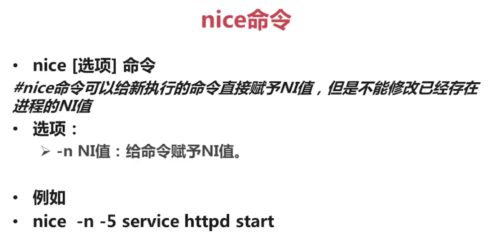

# Linux系统管理

## 进程管理
### 进程管理的作用

> 判断服务器的健康状态

> 查看系统中所有进程

> 杀死进程


### ps&pstree 命令


```
[root@node0 rc3.d]# ps aux
USER        PID %CPU %MEM    VSZ   RSS TTY      STAT START   TIME COMMAND
root          1  0.0  0.1  19348  1612 ?        Ss   Aug22   0:01 /sbin/init
root          2  0.0  0.0      0     0 ?        S    Aug22   0:00 [kthreadd]
root          3  0.0  0.0      0     0 ?        S    Aug22   0:00 [migration/0]
root          4  0.0  0.0      0     0 ?        S    Aug22   0:00 [ksoftirqd/0]
root          5  0.0  0.0      0     0 ?        S    Aug22   0:00 [migration/0]
root          6  0.0  0.0      0     0 ?        S    Aug22   0:00 [watchdog/0]
root          7  0.0  0.0      0     0 ?        S    Aug22   0:00 [migration/1]
root          8  0.0  0.0      0     0 ?        S    Aug22   0:00 [migration/1]
root          9  0.0  0.0      0     0 ?        S    Aug22   0:00 [ksoftirqd/1]
root         10  0.0  0.0      0     0 ?        S    Aug22   0:00 [watchdog/1]
root         11  0.0  0.0      0     0 ?        S    Aug22   0:00 [migration/2]
root         12  0.0  0.0      0     0 ?        S    Aug22   0:00 [migration/2]
root         13  0.0  0.0      0     0 ?        S    Aug22   0:00 [ksoftirqd/2]
root         14  0.0  0.0      0     0 ?        S    Aug22   0:00 [watchdog/2]
```


### top 命令


```
top - 09:22:30 up 13:15,  1 user,  load average: 0.00, 0.00, 0.00
Tasks: 125 total,   1 running, 124 sleeping,   0 stopped,   0 zombie
Cpu(s):  0.0%us,  0.0%sy,  0.0%ni,100.0%id,  0.0%wa,  0.0%hi,  0.0%si,  0.0%st
Mem:    873340k total,   756492k used,   116848k free,    37220k buffers
Swap:  1048568k total,        0k used,  1048568k free,   545996k cached

   PID USER      PR  NI  VIRT  RES  SHR S %CPU %MEM    TIME+  COMMAND                                                                                  
    21 root      20   0     0    0    0 S  0.3  0.0   0:42.51 events/2                                                                                 
 20870 mysql     20   0  304m  25m 3232 S  0.3  3.0   0:00.25 mysqld                                                                                   
 20905 root      20   0 15036 1240  944 R  0.3  0.1   0:00.06 top                                                                                      
     1 root      20   0 19348 1612 1284 S  0.0  0.2   0:01.61 init           

```

### kill&killall&pkill


```
[root@node0 ~]# w
 09:49:25 up 13:42,  2 users,  load average: 0.00, 0.00, 0.00
USER     TTY      FROM              LOGIN@   IDLE   JCPU   PCPU WHAT
root     pts/0    192.168.68.1     09:33    0.00s  0.06s  0.01s w
root     pts/1    192.168.68.1     09:49    3.00s  0.04s  0.04s -bash
[root@node0 ~]# pkill -9 -t pts/1
[root@node0 ~]# w
 09:50:17 up 13:43,  1 user,  load average: 0.00, 0.00, 0.00
USER     TTY      FROM              LOGIN@   IDLE   JCPU   PCPU WHAT
root     pts/0    192.168.68.1     09:33    0.00s  0.05s  0.00s w
```

### 修改进程的优先级

```
[root@node0 ~]# ps -le| more
F S   UID    PID   PPID  C PRI  NI ADDR SZ WCHAN  TTY          TIME CMD
4 S     0      1      0  0  80   0 -  4837 poll_s ?        00:00:01 init
1 S     0      2      0  0  80   0 -     0 kthrea ?        00:00:00 kthreadd
1 S     0      3      2  0 -40   - -     0 migrat ?        00:00:00 migration/0
1 S     0      4      2  0  80   0 -     0 ksofti ?        00:00:00 ksoftirqd/0
1 S     0      5      2  0 -40   - -     0 cpu_st ?        00:00:00 migration/0
5 S     0      6      2  0 -40   - -     0 watchd ?        00:00:00 watchdog/0
1 S     0      7      2  0 -40   - -     0 migrat ?        00:00:00 migration/1
1 S     0      8      2  0 -40   - -     0 cpu_st ?        00:00:00 migration/1
1 S     0      9      2  0  80   0 -     0 ksofti ?        00:00:00 ksoftirqd/1
5 S     0     10      2  0 -40   - -     0 watchd ?        00:00:00 watchdog/1
1 S     0     11      2  0 -40   - -     0 migrat ?        00:00:00 migration/2
1 S     0     12      2  0 -40   - -     0 cpu_st ?        00:00:00 migration/2
```

**PRI代表Priority，NI代表Nice。这两个都是优先级，数字越小代表优先级越高**





## 工作管理

**工作管理指的是在单个登录终端中（也是登录的shell界面中）同事管理多个工作的行为**


### 把进程放入后台
```
tar -zcf etc.tar.gz /etc &
#把命令放入后台，并在后台执行

top
#按下 Ctrl+z 快捷键，放在后台暂停
```

### 查看后台的工作
```
jobs [-l]
  -l : 显示工作的PID

  注： "+"号代表最近一个放入后台的工作，也是工作恢复时，默认恢复的工作。"-"号代表倒数第二个放入后代的工作

```


