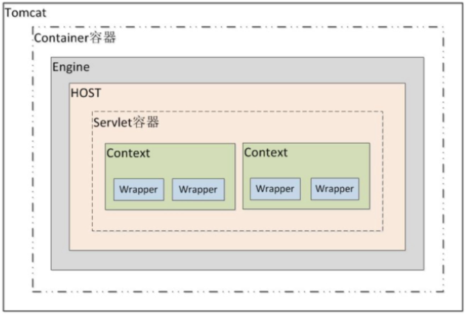
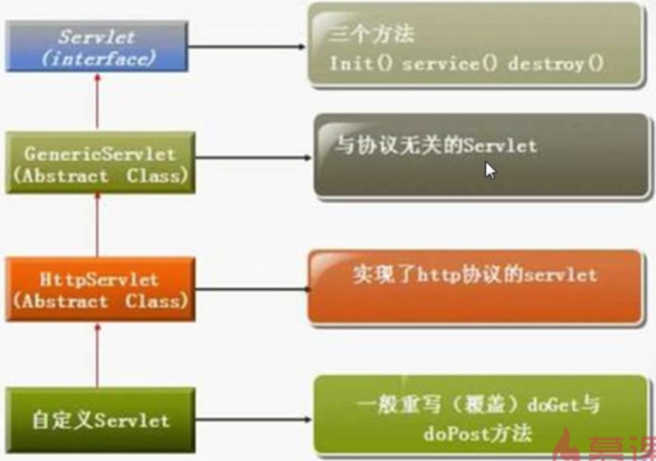
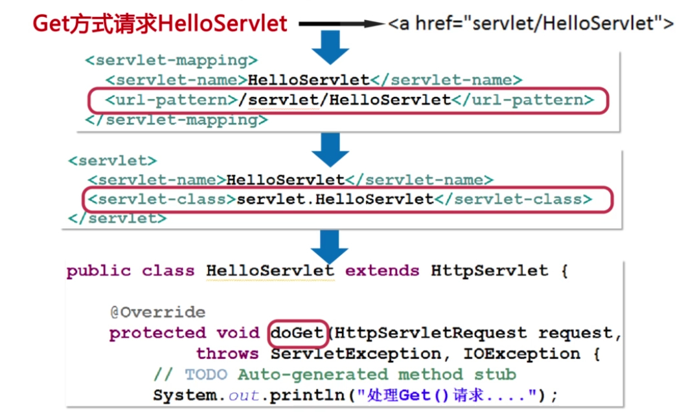
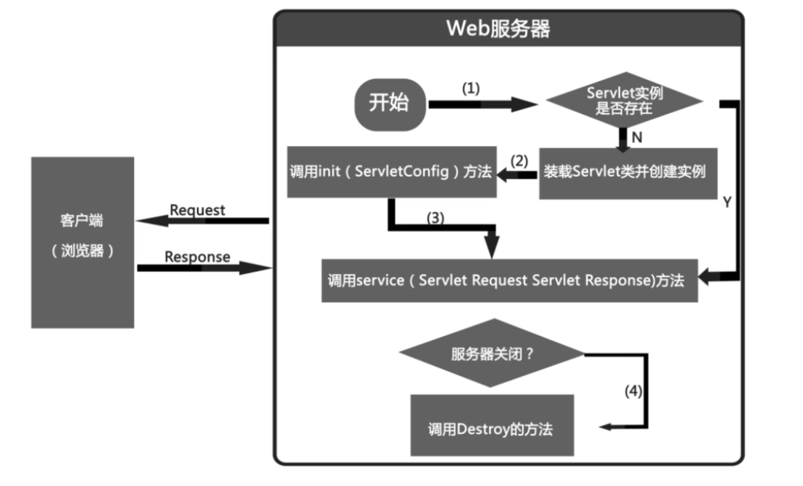

# Servlet 基础

[JAVA遇见HTML——Servlet篇](http://www.imooc.com/learn/269)

## 什么是 Servlet
Servlet 是在服务器上运行的小程序,一个 Servlet 就是一个 Java 类,并且可以通过 "请求-相应"编程模型来访问的这个驻离在服务器内存里的 Servlet 程序

## Tomcat 容器等级

Tomcat 的容器分为四个等级,Servlet 的容器管理 Context 容器,一个 Context 对应一个 Web 工程.

## Engine 引擎容器 ##
## HOST 主机容器 ##

## 手工编写第一个 Servlet
### 1.继承 HttpServlet
### 2.重写 doGet() 或者 doPost() 方法
### 3.在 web.xml 中注册 Servlet

## servlet 执行流程

## servlet 生命周期
**servlet生命周期阶段包括初始化、加载、实例化、服务和销毁。**

**编写Servlet的doPost方法时，需要抛出ServletExcpetion和IOException异常。**

### 1. 初始化阶段,调用init()方法.
### 2.相应客户端请求,调用 service() 方法.由 service() 方法根据提交方式选择执行 doGet() 或者 doPost() 方法.
### 3.终止阶段,调用 destroy() 方法.

### 在下列时刻 Servlet 容器装载 Servlet
** 1.Servlet 容器启动时自动装载某些 Servlet,实现它只需要在 web.xml 文件中的 <servlet></servlet> 之间添加如下代码 :<load-on-startup>1</load-on-startup> 数字越小启动级别越高. **

** 2.在 Servlet 容器启动后,客户首次向 Servlet 发起请求.**

** 3.Servlet 类文件更新后,重新装载 Servlet**

> Servlet 被装载后, Servlet 容器创建一个 Servlet 实例并且调用 Servlet 的 init() 方法进行初始化.在 Servlet 的整个生命周期内,init() 方法只调用一次.
