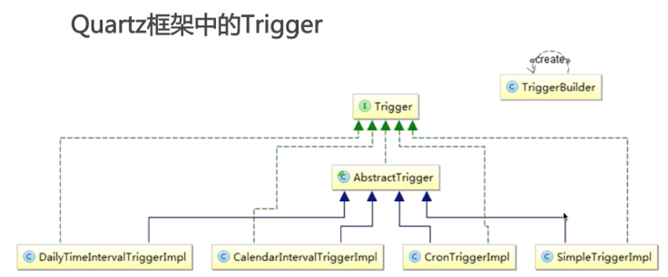
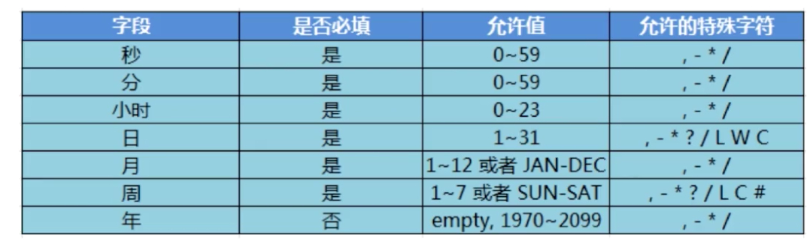

# Quartz


[http://www.quartz-scheduler.org/](http://www.quartz-scheduler.org/)


## Job&JobDetail
### Job

> 实现业务逻辑的任务接口

```
只有一个 execute 方法，类似 TimerTask 的 run 方法，在里面编写业务逻辑
```

#### Job 实例的生命周期

> 每次调度器执行 job 时，在调用 execute 方法前会创建一个新的 job 实例。

> 当调度完成后，关联的 job 对象实例会被释放，释放的实例会被垃圾回收机制回收。


### JobDetail

> JobDetail 为 Job 实例提供许多设置属性，以及 JobDateMap成员变量属性，它用来存储特定 Job 实例的状态信息，调度器需要借助 JobDetail 对象来添加 Job 实例

**name**

**group**

**jobClass**

**jobDataMap**


## JobExecutionContext

> 当 Scheduler 调用一个 Job ，就会将 JobExecutionContext 传递给 Job的 execute() 方法

> Job 能通过 JobExecutionContext 对象访问到 Quartz 运行时的环境以及 Job 本身的明细数据


##  

> 在进行任务调度时 JobDataMap 存储在 JobExecutionContext 中，方便获取

> JobDataMap 可用来装载任何可序列化的数据对象，当 job 实例对象被执行时这些参数对象会传递给它

> JobDataMap 实现了 JDK 的 Map 接口，并且添加了一些非常方便的方法用来存储基本数据类型

### 获取 JobDataMap

> 从 map中直接获取

> Job 实现类中添加 setter 方法对应 JobDataMap 的键值（Quartz 框架默认的 JobFactory 实现类在初始化 Job 实例对象时会自动调用这些setter 方法）

## Tigger



> Quartz  中的触发器用来告诉调度程序作业什么时候触发。即 Tigger 对象是用来触发执行 Job

**触发器通用属性**

> * JobKey
> * StartTime
> * EndTime

**JobKey**

表示 job 实例的表识，触发器被触发时，该指定的 job 实例会执行

**StartTime**

首次触发时间 Java.util.Date

**EndTime**

不再触发时间 Java.util.Date


### SimpleTrigger

### CronTigger

> 基于日历的作业调度器（而不是像 SimpleTigger 那样精确指定间隔时间）

**Cron** 表达式

由7个子表达式组成的字符串，描述了时间的详细信息

格式: [秒] [分] [小时] [日] [月] [周] [年]


**,** 或，多个值

**\-** 区间

**\*** 每

**/** 每（如在秒位上5/15标示从5秒开始，每15秒触发）

**#** 第几个

**L** 最后

**W** 表示离指定日期的最近那个工作日触发

0 15 10 \* \* \* \*         每天10点15分触发

0 0/5 14 \* \* \*           每天下午2点到2点2点59分（整点开始，每5分钟触发）

0 15 10 ? \* MON-FRI        每周一至周五上午10点15分触发

0 15 10 ? \* 6#3            每月第三周星期五触发（6-星期五）

0 15 10 ? \* 6L 2016-2017   从2016年到2017年每个月最后一周星期五的10点15分触发

## Scheduler
### Scheduler-工厂模式

> * 所有的 Scheduler 实例应该由 SchedulerFactory 来创建

### Quart 三个核心概念

> * 调度器 Scheduler
> * 任务 Job
> * 触发器 Tigger

### StdSchedulerFactory

使用一组参数（Java.util.Properties）来创建和初始化 Quart 调度器

配置参数一般存储在 quart.properties 中

调用 getScheduler 方法就能创建和初始化调度器对象

**Scheduler 的主页函数**

> * Date schedulerJob(JobDetail jobDetail, Tigger tigger)
> * start()
> * standby()
> * shutdown()
> *
> *
