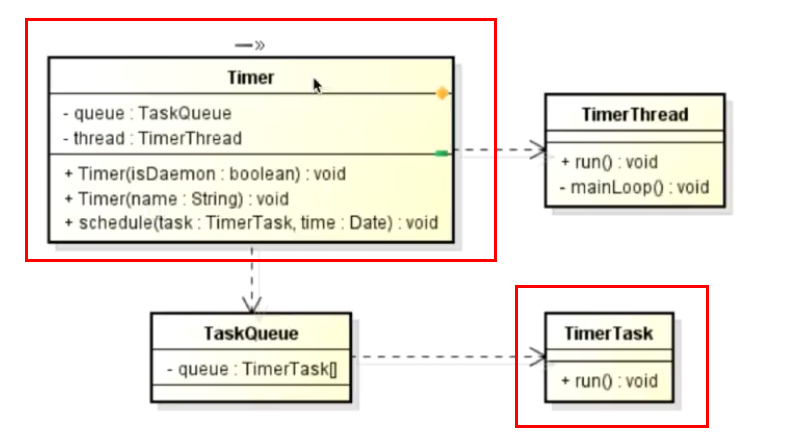

# Timer

## 定义
> 有且仅有**一个后台线程**对**多个业务线程**进行**定时定频的调度**

Timer --> TimerTask `定时调用`

## Timer 的定时调度函数

> * schedule 的四种用法
> * scheduleAtFixedRate 的两种用法

`schedule`**日程安排**
`Rate`**率**
`Fixed`**固定的**

### schedule 的四种用法
#### 一 `schedule(task, time)`
**参数**
> * task - 所要执行的任务
> * time - 执行任务的时间

**作用**
> 在时间等于或超过 time 的时候执行且仅执行一次 task

#### 二 `schedule(task, time, period)`
**参数**
> * task - 所要执行的任务
> * time - 执行任务的时间
> * period - 执行一次 task 的时间间隔，单位毫秒

**作用**
> 在时间等于或超过 time 时首次执行 task，之后每隔 period 毫秒重复执行一次 task

#### 三 `schedule(task, delay)`
**参数**
> * task - 所要执行的任务
> * delay - 执行任务前的延时时间，单位毫秒

**作用**
> 等待 delay 毫秒后执行且仅执行一次 task

#### 四 `schedule(task, delay, period)`
**参数**
> * task - 所要执行的任务
> * delay - 执行任务前的延时时间，单位毫秒
> * period - 执行一次 task 的时间间隔，单位毫秒

**作用**
> 等待 delay 毫秒后执行且仅执行一次 task，之后每隔 period 毫秒重复执行一次 task

### scheduleAtFixedRate 的四种用法
#### 一 `scheduleAtFixedRate(task, time, period)`
**参数**
> * task - 所要执行的任务
> * time - 首次执行任务的时间
> * period - 执行一次 task 的时间间隔，单位毫秒

**作用**
> 时间等于或超过 time 时首次执行 task，之后每隔 period 毫秒重复执行task

#### 二 `scheduleAtFixedRate(task, delay, period)`
**参数**
> * task - 所要执行的任务
> * delay - 执行任务前的延时时间，单位毫秒
> * period - 执行一次 task 的时间间隔，单位毫秒

**作用**
> 等待 delay 毫秒后执行且仅执行一次 task，之后每隔 period 毫秒重复执行一次 task

## 其他函数

> * TimerTask 的 cancel(), scheduledExecutionTime()
> * Timer 的 cancel(), purge()

### TimerTask 的 cancel() `取消当前 TimerTask 里的任务`

### TimerTask 的 scheduledExecutionTime() `返回此任务最近实际执行的已安排执行的时间`
**返回值**
> 最近发生此任务执行安排的时间，为 long 型

### Timer 的 cancel() `终止此计时器，丢弃所有当前已安排的任务`

### Timer 的 purge () `从此计时器的任务队列中移除所有已取消的任务`
**返回值**
> 从队列中移除的任务数

## schedule 与 scheduleAtFixedRate 的区别

> * 首次计划执行的数据赵宇当前的时间
> * 任务执行所需时间超出任务的执行周期间隔
