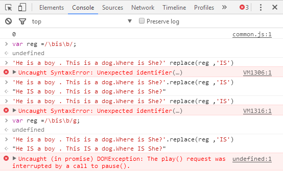

# RegExp对象

## RegExp对象
JavaScript 通过内置对象 RegExg 支持正则表达式

两种方法实例化 RegExg 对象

 * 字面量
 * 构造函数

### 字面量

> var reg =/\bis\b/;
>
> 'He is a boy . This is a dog.Where is She?'.replace(reg ,'IS')

### 构造函数

 > var reg = new RegExp('\\bis\\b','g')
 >
 > 'He is a boy . This is a dog.Where is She?'.replace(reg ,'IS')

## 修饰符

 * g：global 全文搜索，不添加 搜索到第一个匹配停止
 * i：ignore case 忽略大小写 默认大小写敏感
 * m：multiple lines 多行搜索
 * \b：单词边界

