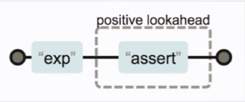

# 量词

> 匹配连续出现20次数字的字符串

## 量词

## 贪婪模式&非贪婪模式

> '12345678'.replace(/\d{3,6}/g,'x')

> "x78"

> '12345678'.replace(/\d{3,6}?/g,'x')

> "xx78"

## 分组
匹配字符串 Byron 连续出现 3 次
> Byron{3}

使用 ( ) 可以达到分组的功能 使量词作用于分组
> (Byrom){3}

## 或
使用 | 可以达到或的效果

> Byron|Casper

## 方向引用

**2016-11-30 => 11/30/2016**

> '2016-11-30'.replace(/(\d{4})-(\d{2})-(\d{2})/g,'$2/$3/$1' )

## 忽略分组

不希望捕获分组 只需要在分组内加上?:

> (?:Byron).(ok)

## 前瞻

 * 正则表达式从文本头部向尾部开始解析，文本尾部方向，称为**“前”**
 * **前瞻**就是在正则表达式匹配到规则的时候，向前检查是否符合断言，后顾/后瞻方向相反
 * **JavaScript*不支持后顾
 * 符合和不符合特定断言称为 **肯定/正向** 匹配和 **否定/负向** 匹配

> 'a2*3'.replace(/\w(?=\d)/g,'X')

> 'a2*3'.replace(/\w(?!\d)/g,'X')

## 对象属性

## test 和 exec 方法

### RegExp.prototype.text(str)
